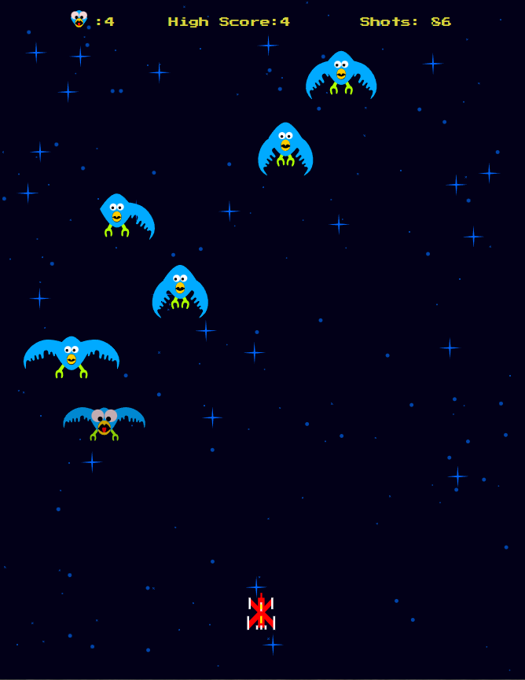

# Fauxnix Game
A simple game based on the 1980 hit game Phoenix! 

## Demo
You can play the game online at [Fauxnix Demo](https://www.snydersweb.com/webSites/researchProjects/fauxnix/).

## Controls
* W or Left Arrow = Left
* D or Right Arrow = Right
* Space Bar or Up Arrow = Fire!

## Tech-Stack
* Reactjs
* SVG

## Description
It has been 100 years since the great alien corruption of the beloved phoenix.  You and your fleet of warships were successful in wiping out the aliens who were twisting the phoenix, however, their legacy remains!  The aliens are no longer feeding the phoenix radioactive material that was making them bomb societies flat.  The problem is the mutated phoenix continues to multiply!  Your mission: your ship has been stripped of shields (budget cuts) and we can equip it with 100 doses of "Population Control".  You are to administer as many doses as you can before you run out and are forced to return to base. 

## Purpose
Deepen my knowledge of React, familiarize myself with using SVG in the browser space, and have fun doing something new and very different.  The graphics/SVG were originally drawn in InkScape and then ported into the game.  To make everything fit I created a scaler function that can grow/shrink things down depending on the size of your screen. 
I learned quite a bit about getting into some components that were somewhat self-running - unlike previous React apps I've built that exclusively respond to user inputs. 

